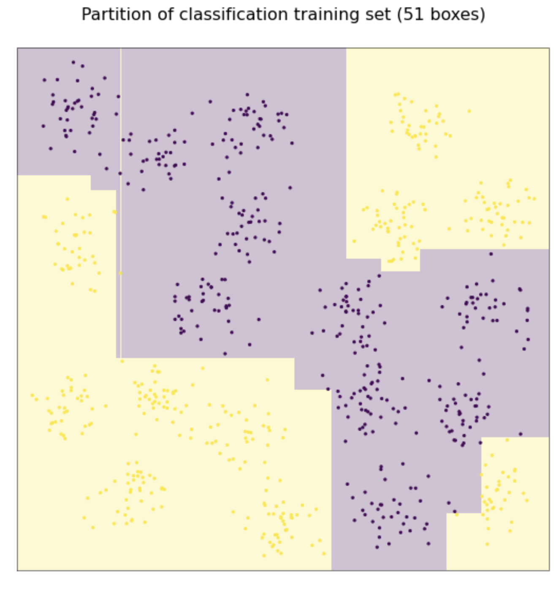
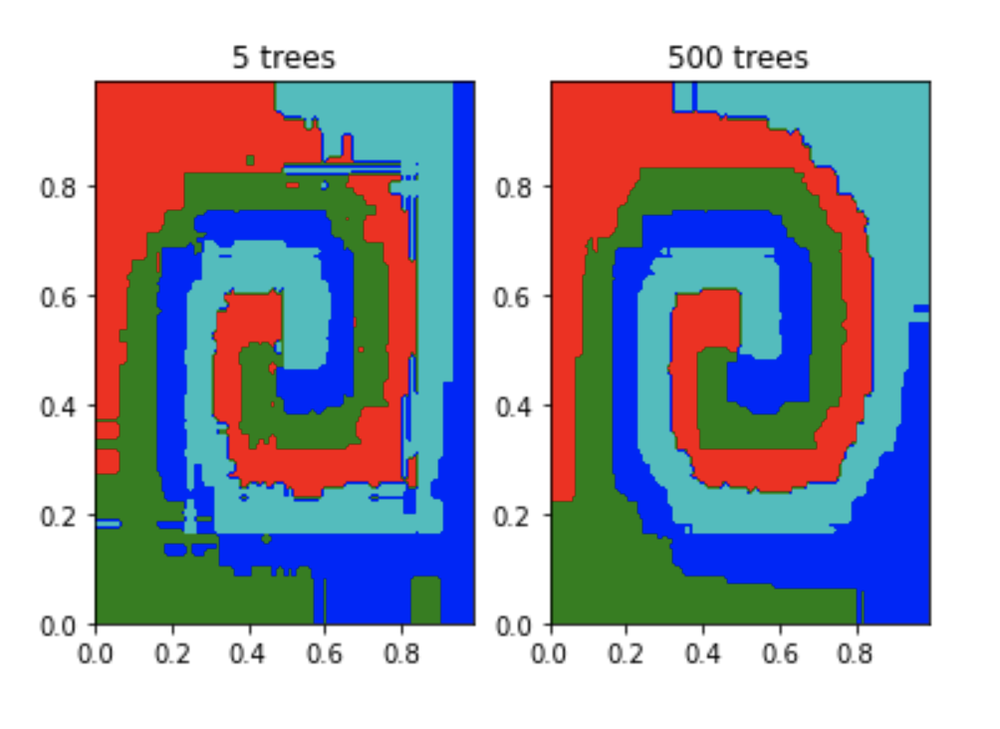

# Decision Trees

This project focuses on exploring decision trees, impurity measures, and random decision forests. It includes code snippets and analyses for various aspects of decision tree-based machine learning.

## Impurity Measures

In this section, we delve into different impurity measures used in decision trees:

- **Error Rate Impurity (`error(q)`):** Measures classification errors.
- **Gini Index Impurity (`gini(q)`):** Quantifies impurity in terms of Gini index.
- **Entropy Impurity (`entropy(q)`):** Calculates impurity using entropy formula.
- **Variance Impurity (`variance(q)`):** Computes impurity based on variance.

## Decision Tree Basics

Explore the basics of decision trees and their traversal:

- **Traversing Decision Trees:** Understand how decision trees work and predict values based on probability distributions.
- **OOB Accuracy vs. Test Accuracy:** Compare out-of-bag (OOB) accuracy estimates with test accuracy for random decision forests.

## andom Decision Forests

Dive into random decision forests and their application:

- **Spiral Dataset Exploration:** Analyze the spiral dataset and its classification using random decision forests.
- **OOB Accuracy and Test Accuracy Comparison:** Discuss the reliability of OOB accuracy estimates compared to test accuracy.
